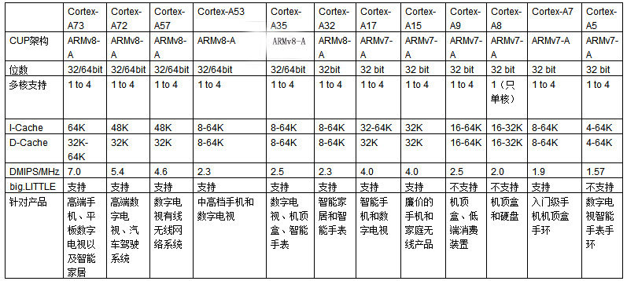

# [Cortex A](https://github.com/mcuyun/CA) 

#### 归属架构：[ARM](https://github.com/mcuyun/ARM)
#### [关于悠云](https://github.com/mcuyun/whyme)可访问 www.mcuyun.com

## [简介](https://github.com/mcuyun/CA/wiki)

ARM公司的Cortex-A系列处理器适用于具有高计算要求、运行丰富操作系统以及提供交互媒体和图形体验的应用领域。

### [Cortex A72](https://github.com/mcuyun/CA72) 

基于ARMv8-A架构，最早发布于2015年年初，在相同的移动设备电池寿命限制下，Cortex-A72能相较基于Cortex-A15的设备提供3.5倍的性能表现，相比于Cortex-A57也有约1.8倍的性能提升。

### [Cortex A53](https://github.com/mcuyun/CA53)

基于ARMv8-A 64架构，单个核心的功耗不超过0.13W，最小的64位处理器，能够支持32位的ARMv7代码和64位代码的AArch64执行状态，A53相比A9最大的优势在于程序执行效率，是当前国产芯片的主流架构之一。

### [Cortex A35](https://github.com/mcuyun/CA35)

基于ARMv8-A 64位架构设计的一款低功耗CPU，2015年底发布，A35的功耗比A7低大约10%，目标功耗不超过125毫瓦，同时性能提升6-40%。而对比A53，它可以保留80-100%的性能，但是功耗降低32%、面积缩小25%，能效提升25%。

### [Cortex A7](https://github.com/mcuyun/CA7)

基于ARMv7-A架构的高能效处理器，自2012年开始被广泛用，结构和功能集与Cortex-A15 处理器完全相同，不同这处在于，Cortex-A7 处理器的微体系结构侧重于提供最佳能效，被广泛使用。

### [Cortex A5](https://github.com/mcuyun/CA5)

基于ARMv7-A架构，1.57DMIPS/MHz，它是能效最高、成本最低的A处理器。Cortex-A5 处理器还保持与经典 ARM 处理器（包括 ARM926EJ-S、ARM1176JZ-S 和 ARM7TDMI?）的向后应用程序兼容性。

## [ARM平台](https://github.com/mcuyun/ARM)

####  -> [Cortex A](https://github.com/mcuyun/CA)

ARM Cortex™-A 系列面向尖端的基于虚拟内存的操作系统和用户应用。

####  [Cortex R](https://github.com/mcuyun/CR)

ARM Cortex™-R实时处理器为要求可靠性、高可用性、容错功能、可维护性和实时响应的嵌入式系统提供高性能计算解决方案。

####  [Cortex M](https://github.com/mcuyun/CM)

ARM Cortex™-M处理器系列可向上兼容的高能效、易于使用的处理器，这些处理器旨在帮助开发人员满足将来的嵌入式应用的需要。

---

###  www.mcuyun.com   
###  qitas@qitas.cn
