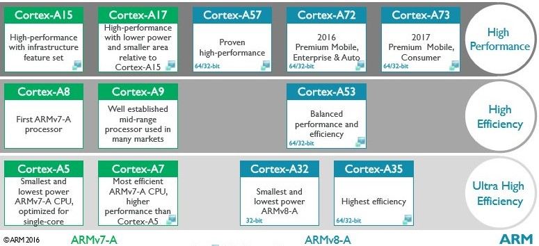
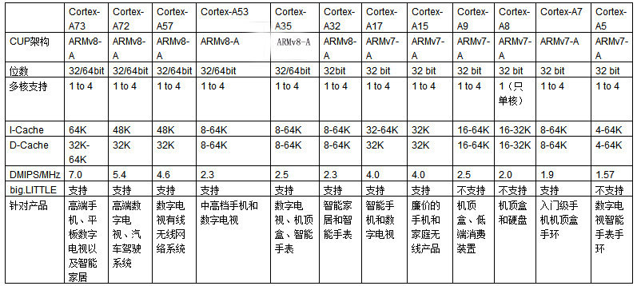

# [arm cortex A](https://github.com/sochub/CA)

#### 归属：[arm](https://github.com/sochub/arm) 

## [简介](https://github.com/sochub/CA/wiki)

ARM公司的[cortex A](https://developer.arm.com/ip-products/processors/cortex-a)系列处理器适用于具有高计算要求、运行丰富操作系统以及提供交互媒体和图形体验的应用领域。

* [Cortex A76](https://github.com/sochub/CA76)
* [Cortex A73](https://github.com/sochub/CA73)
* [Cortex A72](https://github.com/sochub/CA72)
* [Cortex A57](https://github.com/sochub/CA57)
* [Cortex A55](https://github.com/sochub/CA55)
* [Cortex A53](https://github.com/sochub/CA53)
* [Cortex A35](https://github.com/sochub/CA35)
* [Cortex A17](https://github.com/sochub/CA17)
* [Cortex A15](https://github.com/sochub/CA15)
* [Cortex A9](https://github.com/sochub/CA9)
* [Cortex A7](https://github.com/sochub/CA7)
* [Cortex A5](https://github.com/sochub/CA5)

### [cortex系列](https://github.com/sochub/ARM)

* [Cortex A](https://github.com/sochub/CA)
* [Cortex R](https://github.com/sochub/CR)
* [Cortex M](https://github.com/sochub/CM)

###  [SoC资源平台](http://www.qitas.cn)